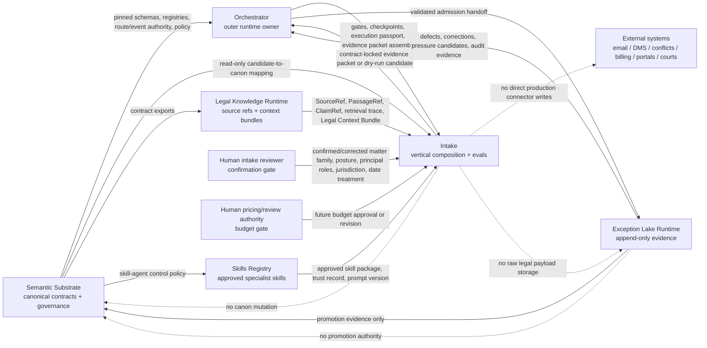

# Data Flow Map

Last reviewed: 2026-06-23.

`LawFirm-os-intake` is the private vertical composition and evaluation repo for the intake-to-budget workflow. It is subordinate to the five public LawFirm OS platform repos and owns no canonical authority.

Current GitHub posture:

- `lowelltwong-alt/LawFirm-os-intake` exists as a private repo with default branch `main`.
- The private repo has been seeded and CI is green as of commit `4d3d67b0324c59aba90f9a3100dc082f19f8b84a`.
- Build-out branch `codex/build-out-intake-vertical` adds the governed intake-to-budget vertical, messy north-star fixture, dry-run Exception Lake candidates, review package, safety gate, and local contract-state gate. CI status must be checked against the latest pushed commit before claiming it is green.
- Semantic Substrate registration branch `codex/register-intake-control-plane` is pushed and CI green; it must still be reviewed/merged before treating intake membership as canonical on Substrate `main`.
- The five public sibling repos are reachable on `main`; pin adoption must use reviewed immutable SHAs, not local copied-folder assumptions.

## Authority Order

| Plane | Repo | Governs | Intake may do |
|---|---|---|---|
| Control | `LawFirm-os-semantic-substrate` | Canonical schemas, registries, governance doctrine, route IDs, event classes, lifecycle policy, AI front door, contract manifests | Consume read-only; propose candidate changes for later promotion |
| Execution | `LawFirm-os-orchestrator` | Runtime workflow execution, gates, approvals, model/tool routing, run ledgers, evidence packet assembly, guarded lake handoff | Provide vertical reference flow, fixtures, evals, and acceptance tests |
| Legal knowledge | `LawFirm-os-legal-knowledge-runtime` | Ingestion preflight, document integrity, retrieval planning, SourceRef/PassageRef/ClaimRef, Legal Context Bundles | Request bounded context and source refs; never fan out raw payloads |
| Skill supply chain | `LawFirm-os-skills-registry` | Approved/candidate skills, scans, evals, trust records, prompt versions, revocation metadata | Use predeclared approved specialists or propose candidate skills |
| Evidence | `LawFirm-os-exceptions-lake-runtime` on GitHub; `exceptions-lake-runtime-main` as the local/canonical runtime name | Append-only runtime evidence, audit records, defects, corrections, retrieval traces, pressure candidates | Emit contract-locked evidence packets or dry-run candidates only |
| Vertical | `LawFirm-os-intake` | Intake-to-budget workflow specification, synthetic fixtures, local candidate schemas, reference demo, vertical evals | Compose and evaluate; never define platform canon |

When these disagree, Semantic Substrate wins unless a human-approved governance change says otherwise.

## Cross-Repo Flow



## Intake Runtime Flow

```text
synthetic source bundle
-> reviewed contract-state gate for sibling repo locks
-> data-origin and authorization gate
-> source inventory
-> provenance-preserving segmentation
-> party and relationship-role candidates
-> inbound-event, matter-family, and representation-posture candidates
-> date/deadline and missing-information candidates
-> independent evidence review
-> dry-run Exception Lake candidates for retrieval misses, workflow escalations, and authority conflicts
-> human intake confirmation
-> human review outcome record and append-only confirmation history
-> budget precondition gate
-> conflict-search seed packet, with evidence-bound normalized terms and no conflict conclusion
-> legal budget proposal, not approved or submitted
-> matter-opening readiness packet
-> budget-blocker dry-run Exception Lake candidate
-> deterministic safety gate report
-> consolidated matter-opening review package and manifest
-> blocked_pending_conflicts_and_engagement
```

The outer runtime owner is `LawFirm-os-orchestrator`. The local intake CLI is a reference implementation and evaluation harness until the runtime mechanics are promoted.

## Principal Cross-Boundary Objects

| Object | Owner | Direction | Notes |
|---|---|---|---|
| Candidate intake schemas in `schemas/` | Intake candidate surface | Local only | Must not masquerade as promoted Semantic Substrate canon |
| `ContractStateReport` in `contract_state_report.json` | Intake candidate surface | Intake -> Human reviewer / Orchestrator review path | Verifies local `contracts.lock.json` and `repo_topology.lock.yaml` are reviewed, parseable, SHA-pinned, topology-matched, and non-authoritative before packet generation |
| `EvidenceRef` | Intake candidate surface; future Substrate candidate | Intake -> Human reviewer / Orchestrator review path | Self-contained source evidence pointer with source ID, segment ID, segment offsets, and segment hash; strict mode validates refs against the segment table |
| `SourceRef` / `PassageRef` / `ClaimRef` | Legal Knowledge Runtime under substrate contracts | Legal Knowledge -> Intake -> Evidence Packet | Prefer refs, offsets, hashes, and bundle IDs over raw text payloads |
| Legal Context Bundle | Legal Knowledge Runtime under substrate contracts | Legal Knowledge -> Orchestrator/Intake | Context is evidence and decision support, not observed fact |
| Execution passport / run ledger | Orchestrator | Orchestrator <-> Intake | Carries contract pin, decision model, approval state, and gate results |
| Evidence packet | Orchestrator | Orchestrator -> Exception Lake | Principal admission unit for runtime evidence |
| `ExceptionLakeCandidate` in `exception_lake_candidates.jsonl` | Intake candidate surface | Intake -> Orchestrator -> Exception Lake review path | Dry-run only; maps to broad existing Lake classes, includes no raw payload, and may carry source refs, evidence refs, or structured refs |
| `EvidenceGraph` in `evidence_graph.json` | Intake candidate surface | Intake -> Human reviewer / Orchestrator review path | Links source, segment, candidate, human confirmation, review outcome, conflict-search term, budget line, budget support, structured-ref, and proposal nodes |
| `ReviewPackageManifest` and `matter_opening_review_package.md` | Intake candidate surface | Intake -> Human reviewer / Orchestrator review path | One-run review surface linking contract state, knowns, unknowns, evidence refs, conflict seed, budget, exception candidates, blockers, ledgers, and prohibited actions |
| `HumanReviewOutcomeRecord` and `human_confirmation_history.jsonl` | Intake candidate surface | Intake -> Human reviewer / Orchestrator review path | Records how a human confirmation outcome was handled; non-confirmed outcomes block budget, confirmed outcomes advance only to precondition checks, and superseding corrections append new records instead of mutating prior outcomes |
| `ConflictSeedPacket` / `ConflictSearchTerm` | Intake candidate surface | Intake -> Human reviewer / Orchestrator review path | Search-seed inputs only; normalized terms are grouped by role and must carry evidence refs from the source-bound human confirmation; conclusion remains `no_conflict_conclusion` |
| `BudgetSupportItem` | Intake candidate surface | Intake -> Human reviewer / Orchestrator review path | Evidence or structured-ref support for budget assumptions, exclusions, and unknowns |
| `BudgetPreconditionReport` | Intake candidate surface | Intake -> Human reviewer / Orchestrator review path | Deterministic proof that the budget stage had a matching, confirmed, evidence-bound human confirmation before emitting conflict seed, proposal, readiness, safety, or review package artifacts |
| `SafetyGateReport` | Intake candidate surface | Intake -> Human reviewer / Orchestrator review path | Deterministic proof that contract-state binding is carried forward, required conflict/budget evidence remains source-bound or structured-ref-supported, and prohibited legal, conflict, engagement, docketing, billing, external-write, matter-opening, and submission states are absent |
| Exception/admission/audit records | Exception Lake Runtime | Exception Lake append-only store | Evidence only; no canon mutation or raw legal payload storage |
| Skill trust record / prompt version | Skills Registry under substrate policy | Skills Registry -> Orchestrator/Intake | Specialist use requires declared context, tool authority, human gate, and revocation path |

## Exception Classification And Lake Handoff

Intake-specific exception labels are evidence labels unless and until Semantic Substrate promotes them as canonical route/event authority. Today, the broad canonical lake classes already visible in the platform are:

| Canonical class | Intake examples that can map here | Lake posture |
|---|---|---|
| `retrieval_miss` | missing source, unread source, unreadable attachment, unresolved source ref, incomplete Legal Context Bundle, missing jurisdiction reference, source coverage gap | Append evidence and validation detail; do not invent missing facts |
| `workflow_escalation` | human review required, role ambiguity, contradictory candidates, missing information, prompt-injection source content, prohibited transition attempted, budget blocked before confirmation, budget unknowns, missing budget template, hours-only missing rates | Append escalation trigger and current blocked state |
| `authority_conflict_override` | local candidate conflicts with pinned canon, missing reviewed lock, topology mismatch, route/event ID not registered, prompt/tool authority mismatch, contract SHA drift, profile tries to expand authority | Fail closed and emit only allowed audit/evidence metadata |

Future intake event labels named in this repo, such as `intake_preflight_proposed`, `intake_classification_confirmed`, `party_role_corrected`, `practice_context_missing_or_misleading`, `conflict_seed_prepared`, `budget_proposal_created`, `budget_proposal_corrected`, and `profile_change_candidate`, must either:

1. map to an existing canonical route/event class through a reviewed adapter, or
2. be promoted first through Semantic Substrate before Exception Lake runtime accepts them as first-class event classes.

The current local workflow writes `exception_lake_candidates.jsonl` in both preflight and budget run directories. Each row is a dry-run candidate with `raw_payload_included=false`, `canonical_promotion_required=true`, a broad canonical Lake class, and source-inventory refs, evidence refs, or structured refs. Failed budget precondition attempts also write a dry-run workflow escalation candidate before stopping. The file is not an admission log and is not a SQLite store.

## SQLite Direction For Exception Lake

If the Exception Lake later uses SQLite for local runtime storage, that belongs in `LawFirm-os-exceptions-lake-runtime`, not in this intake repo. Intake should emit an evidence packet or dry-run candidate; the lake should own the SQLite schema, migrations, admission validation, append-only semantics, and audit tables.

Minimum SQLite posture:

- append-only tables for admitted events and audit records;
- immutable packet/admission IDs, contract SHA, route ID, event class, source refs, validation result, and record hash;
- correction/supersession records instead of updates in place;
- no raw source document, email body, privileged payload, or real client/matter content in the starter;
- local synthetic/dry-run mode until non-synthetic readiness is separately approved.

## Data Classes

| Class | May enter starter runtime? | Handling |
|---|---:|---|
| Synthetic source | Yes | Local-only, source-bound, segmented, hashed |
| Synthetic practice profile and rates | Yes | Versioned and clearly labeled synthetic |
| Public source catalog metadata | Documentation/planning only | No direct runtime ingestion in the starter |
| Real public case content | No | Future governed pilot only |
| Real client or matter content | No | Stop immediately |
| Privileged or confidential material | No | Stop immediately |
| Real negotiated rates or guidelines | No | Future private profile store only after governance |

## Prohibited Outputs

The intake flow never emits:

- a conflict conclusion;
- a represented-client conclusion without human confirmation;
- an engagement decision;
- a docketed deadline;
- a submitted or approved budget;
- a matter-opened state;
- an iManage/email/billing/carrier/court write;
- a canonical schema, route ID, event class, party role, matter taxonomy, or budget taxonomy.

## Current Integration Gaps

These are the remaining data-flow gaps to close before claiming the private intake repo is fully tied into the OS:

1. Review and merge the pushed Semantic Substrate registration branch before claiming canonical Substrate `main` membership.
2. Register any intake-specific event labels in Semantic Substrate before treating them as canonical Lake event classes.
3. Keep the workspace as clean sibling clones or an intentional submodule superproject; do not rely on copied child folders as sync truth.

The local starter now emits and enforces `contract_state_report.json` for each preflight run. That proves the private vertical used the reviewed local lock files; it does not replace the sibling repo governance steps above.

Workspace note: the pushed Semantic Substrate registration branch explicitly excludes `LawFirm-os-talent-intelligence-private` from this kernel registry until that separate private vertical receives its own admission decision.

## Validation

For this repo:

```powershell
python .\scripts\validate_repo.py
python -m pytest
bash .\scripts\smoke_demo.sh
```

For cross-repo front-door/control-plane checks from the workspace root:

```powershell
python .\LawFirm-os-semantic-substrate\scripts\validate_ai_front_door.py --substrate-root .\LawFirm-os-semantic-substrate
python .\LawFirm-os-semantic-substrate\scripts\validate_skill_agent_control_plane.py --workspace .
```
