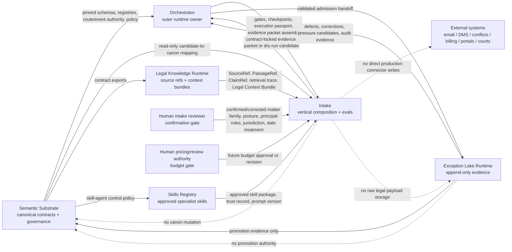

# Data Flow Map

Last reviewed: 2026-06-26.

`LawFirm-os-intake` is the private vertical composition and evaluation repo for the intake-to-budget workflow. It is subordinate to the five public LawFirm OS platform repos and owns no canonical authority.

Current GitHub posture:

- `lowelltwong-alt/LawFirm-os-intake` exists as a private repo with default branch `main`.
- The private repo has been seeded and CI is green as of commit `4d3d67b0324c59aba90f9a3100dc082f19f8b84a`.
- Build-out branch `codex/build-out-intake-vertical` adds the governed intake-to-budget vertical, messy north-star fixture, dry-run Exception Lake candidates, review package, safety gate, and local contract-state gate. CI status must be checked against the latest pushed commit before claiming it is green.
- Semantic Substrate registration branch `codex/register-intake-control-plane` is pushed and CI green; it must still be reviewed/merged before treating intake membership as canonical on Substrate `main`.
- The five public sibling repos are reachable on `main`; pin adoption must use reviewed immutable SHAs, not local copied-folder assumptions.

## Authority Order

| Plane | Repo | Governs | Intake may do |
|---|---|---|---|
| Control | `LawFirm-os-semantic-substrate` | Canonical schemas, registries, governance doctrine, route IDs, event classes, lifecycle policy, AI front door, contract manifests | Consume read-only; propose candidate changes for later promotion |
| Execution | `LawFirm-os-orchestrator` | Runtime workflow execution, gates, approvals, model/tool routing, run ledgers, evidence packet assembly, guarded lake handoff | Provide vertical reference flow, fixtures, evals, and acceptance tests |
| Legal knowledge | `LawFirm-os-legal-knowledge-runtime` | Ingestion preflight, document integrity, retrieval planning, SourceRef/PassageRef/ClaimRef, Legal Context Bundles | Request bounded context and source refs; never fan out raw payloads |
| Skill supply chain | `LawFirm-os-skills-registry` | Approved/candidate skills, scans, evals, trust records, prompt versions, revocation metadata | Use predeclared approved specialists or propose candidate skills |
| Evidence | `LawFirm-os-exceptions-lake-runtime` on GitHub; `exceptions-lake-runtime-main` as the local/canonical runtime name | Append-only runtime evidence, audit records, defects, corrections, retrieval traces, pressure candidates | Emit contract-locked evidence packets or dry-run candidates only |
| Vertical | `LawFirm-os-intake` | Intake-to-budget workflow specification, synthetic fixtures, local candidate schemas, reference demo, vertical evals | Compose and evaluate; never define platform canon |

When these disagree, Semantic Substrate wins unless a human-approved governance change says otherwise.

## Cross-Repo Flow



## Intake Runtime Flow

```text
synthetic source bundle
-> reviewed contract-state gate for sibling repo locks
-> model adapter guard report for deterministic or structured-model dry-run posture
-> data-scope gate report proving synthetic-only authorization before raw payload write
-> optional reviewed synthetic fixture-gold gate when `--fixture-gold` is supplied
-> Python reference ingestion result for source inventory, coverage, segmentation, hashes, and segment evidence refs
-> ingestion volume profile for source/segment scale, compute pressure signals, and profiling-before-Rust pressure
-> Rust ingestion readiness report proving the Python artifact is a future parity target, not replacement authorization
-> party and relationship-role candidates
-> inbound-event, matter-family, and representation-posture candidates
-> date/deadline and missing-information candidates
-> evidence completeness report proving source-bound candidates, unknown options, and human-review boundary
-> context boundary report proving practice context remains transparent prior/context rather than observed evidence
-> deadline docketing guard report proving review-only candidates and no docketing
-> independent evidence review
-> dry-run Exception Lake candidates for retrieval misses, workflow escalations, and authority conflicts
-> Exception Lake readiness report for dry-run candidate handoff safety
-> Exception Lake handoff manifest summarizing labels, support modes, target owner, and no SQLite admission
-> human intake confirmation
-> human review outcome record and append-only confirmation history
-> budget precondition gate
-> human gate status report proving completed intake confirmation and pending human approvals
-> conflict-search seed packet, with evidence-bound normalized terms and no conflict conclusion
-> case driver profile, with provenance-separated observed/confirmed, profile-default, and unknown drivers
-> legal budget proposal, not approved or submitted
-> carrier-compliant projection for synthetic guideline caps, proposal lines unchanged
-> budget submission guard report proving no client/carrier delivery or billing handoff
-> matter-opening readiness packet
-> budget-blocker dry-run Exception Lake candidate
-> Exception Lake mapping package for budget template, code mapping, driver, guideline, human-change, and actual-variance evidence families
-> phase-level budget actual comparison report, with no billing connector read/write in intake
-> deterministic safety gate report
-> consolidated matter-opening review package and manifest
-> deterministic review package completeness report for artifact, section, gate, blocker, and boundary checks
-> run-ledger integrity reports proving local gate order, terminal state, local refs, and no external writes
-> optional starter release audit report over generated demo artifacts
-> optional blocked-budget attempt audit proving failed human confirmation emits no proposal outputs
-> optional context counterfactual audit proving rankings may change but source evidence stays stable
-> blocked_pending_conflicts_and_engagement
```

The outer runtime owner is `LawFirm-os-orchestrator`. The local intake CLI is a reference implementation and evaluation harness until the runtime mechanics are promoted.

## Principal Cross-Boundary Objects

| Object | Owner | Direction | Notes |
|---|---|---|---|
| Candidate intake schemas in `schemas/` | Intake candidate surface | Local only | Must not masquerade as promoted Semantic Substrate canon |
| `ContractStateReport` in `contract_state_report.json` | Intake candidate surface | Intake -> Human reviewer / Orchestrator review path | Verifies local `contracts.lock.json` and `repo_topology.lock.yaml` are reviewed, parseable, SHA-pinned, topology-matched, and non-authoritative before packet generation |
| `DataScopeGateReport` in `data_scope_gate_report.json` | Intake candidate surface | Intake -> Human reviewer / Orchestrator review path | Proves starter runtime mode is `synthetic_only`, source origin is `synthetic`, real client, real matter, and privileged data flags are false, public direct ingestion is not allowed, no external write occurred, and raw payload was not written before the gate; blocks before raw input storage or ingestion on failure |
| `ModelAdapterReport` in `model_adapter_report.json` | Intake candidate surface | Intake -> Human reviewer / Orchestrator review path | Dry-run adapter guard proving prompt hashes, zero provider calls, zero model/tool budget, typed JSON requirement, tool denylist, no network/external writes, independent critic, human gates, deterministic baseline authority, typed-JSON validation, deterministic baseline hash comparison, structured dry-run candidate hash, and reviewed synthetic-gold status when `structured-model` is selected |
| `FixtureGoldSpec` and `FixtureGoldReport` in `fixture_gold_report.json` | Intake candidate/eval surface | Intake -> Human reviewer / Orchestrator review path | Optional reviewed synthetic gold gate for source coverage, top-three matter recall, role candidates, deadline candidates, missing information, dry-run exception labels, conflict/budget boundaries, safety status, blockers, and no external writes; local eval evidence only, not canon |
| `IngestionResult` in `ingestion_result.json` | Intake candidate surface | Intake -> Human reviewer / Orchestrator review path | Python reference artifact and future Rust parity oracle for source inventory, coverage summary, structural segments, and segment-level evidence refs; does not classify legal meaning |
| `RustTransitionPolicy` in `config/rust-ingestion-transition-policy.json` | Intake candidate surface | Local candidate policy -> Intake reports / Human reviewer | Local noncanonical manifest for Rust profiling thresholds, benchmark dimensions, allowed hot-path scope, forbidden legal/runtime scope, parity dimensions, and transition gates; records no Rust runtime, no replacement authorization, and no external writes |
| `IngestionVolumeProfile` in `ingestion_volume_profile.json` | Intake candidate surface | Intake -> Human reviewer / Orchestrator review path | Deterministic scale profile for source count, character volume, segment count, source/segment type counts, local profiling thresholds, compute pressure signals, required performance profile dimensions, candidate Rust hot-path scope, `rust_adapter_proposal_state`, and required Rust transition gates loaded from `rust_transition_policy_ref`; may require profiling before a Rust adapter proposal but keeps `rust_replacement_allowed=false` |
| `RustIngestionReadinessReport` in `rust_ingestion_readiness_report.json` | Intake candidate surface | Intake -> Human reviewer / Orchestrator review path | Deterministic proof that the current Python ingestion artifact has a locked adapter boundary, recomputable source hashes, bounded segment offsets, matching segment evidence refs, no legal decision scope, and parity requirements loaded from `rust_transition_policy_ref`; keeps `rust_replacement_allowed=false` |
| `EvidenceRef` | Intake candidate surface; future Substrate candidate | Intake -> Human reviewer / Orchestrator review path | Self-contained source evidence pointer with source ID, segment ID, segment offsets, and segment hash; strict mode validates refs against the segment table |
| `EvidenceCompletenessReport` in `evidence_completeness_report.json` | Intake candidate/eval surface | Intake -> Human reviewer / Orchestrator review path | Local proof that party, role, inbound-event, matter-family, posture, deadline, missing-information, and critic outputs carry source-bound refs matching packet segments; also verifies unknown options and human-review/prohibited-step boundaries remain present |
| `ContextBoundaryReport` in `context_boundary_report.json` | Intake candidate/eval surface | Intake -> Human reviewer / Orchestrator review path | Local proof that effective context profile ID/version/hash are visible, observed source evidence keeps precedence, context refs stay structured practice-profile refs, context-influenced candidates remain source-anchor-only unless independently observed, unknown options remain available, and human confirmation remains required |
| `ScoredCandidate.source_evidence_status` | Intake candidate surface | Intake -> Human reviewer / Orchestrator review path | Distinguishes refs that are direct `observed_support` from `source_anchor_only` packet anchors and `unknown_option` anchors, so practice-context priors are not rendered as observed facts |
| `intake_review_form.md` | Intake candidate surface | Intake -> Human reviewer / Orchestrator review path | First human-pause surface showing source inventory detail, candidate alternatives, evidence refs, deadlines, missing information, critic findings, review outcome handling, append/supersede mutation policy, and prohibited next steps |
| `DeadlineDocketingGuardReport` in `deadline_docketing_guard_report.json` | Intake candidate surface | Intake -> Human reviewer / Orchestrator review path | Local proof that deadline candidates remain source-bound, non-authoritative, proposed only for `human_deadline_review`, and not docketed; records `docketing_action_performed=false`, `docketing_action_allowed=false`, no external writes, candidate evidence refs, and prohibited-transition structured refs |
| `SourceRef` / `PassageRef` / `ClaimRef` | Legal Knowledge Runtime under substrate contracts | Legal Knowledge -> Intake -> Evidence Packet | Prefer refs, offsets, hashes, and bundle IDs over raw text payloads |
| Legal Context Bundle | Legal Knowledge Runtime under substrate contracts | Legal Knowledge -> Orchestrator/Intake | Context is evidence and decision support, not observed fact |
| Execution passport / run ledger | Orchestrator | Orchestrator <-> Intake | Carries contract pin, decision model, approval state, and gate results |
| Evidence packet | Orchestrator | Orchestrator -> Exception Lake | Principal admission unit for runtime evidence |
| `PartyCandidate` / `RoleCandidate` | Intake candidate surface | Intake -> Human reviewer / Orchestrator review path | Candidate parties and every role alternative carry source-bound evidence refs; role alternatives are candidates, not represented-client conclusions |
| `ExceptionLakeCandidate` in `exception_lake_candidates.jsonl` | Intake candidate surface | Intake -> Orchestrator -> Exception Lake review path | Dry-run only; maps to broad existing Lake classes, includes no raw payload, and may carry source refs, evidence refs, or structured refs; close role alternatives become role-ambiguity critic candidates, and untrusted attempts to clear conflicts, open matters, create workspaces, docket deadlines, submit budgets, or send external messages become specific local prohibited-transition candidates |
| `ExceptionLakeReadinessReport` in `exception_lake_readiness_report.json` | Intake candidate surface | Intake -> Human reviewer / Orchestrator review path | Deterministic proof that local exception candidates remain dry-run, raw-payload-free, promotion-required, target the Lake runtime repo, and cite known inventory refs, packet evidence refs, structured refs, or blocked states |
| `ExceptionLakeHandoffManifest` in `exception_lake_handoff_manifest.json` | Intake candidate surface | Intake -> Human reviewer / Orchestrator review path | Machine-readable dry-run map of actual local labels to broad Lake classes, support modes, candidate files, readiness report, target runtime owner, and `sqlite_write_performed=false`; not an admission log and not a Lake persistence schema |
| `ExceptionLakeMappingPackage` in `exception_lake_mapping_package.json` | Intake candidate surface | Intake -> Human reviewer / Orchestrator -> Exception Lake review path | Dry-run mapping package for broken original-budget formulas, missing budget code mappings, unknown budget drivers, guideline/cap issues, human budget changes, and budget actual-cost variance; maps local labels to broad Lake classes while preserving `sqlite_write_performed=false`, `external_writes_performed=false`, raw-payload exclusion, and canonical-promotion requirement |
| `EvidenceGraph` in `evidence_graph.json` | Intake candidate surface | Intake -> Human reviewer / Orchestrator review path | Links source, segment, candidate, human confirmation, review outcome, conflict-search term, budget line, budget support, matter-opening blocker, prohibited-action guardrail, structured-ref, and proposal nodes; candidate edges use `supports_*` only for observed support and `anchors_*` for context-only or unknown-option anchors |
| `MatterOpeningReadiness` in `matter_opening_readiness.json` | Intake candidate surface | Intake -> Human reviewer / Orchestrator review path | Blocked readiness packet preserving satisfied preconditions, final blockers, structured blocker details, prohibited actions, prohibited-action guardrails, required human gates, workflow-policy refs, and prohibited-transition refs; does not open a matter, create a workspace, clear conflicts, approve engagement, or submit a budget |
| `ReviewPackageManifest` and `matter_opening_review_package.md` | Intake candidate surface | Intake -> Human reviewer / Orchestrator review path | One-run review surface linking contract state, data-scope gate, human review outcome, budget preconditions, source inventory, knowns, candidate alternatives, unknowns, required human gates, visible evidence refs with source IDs, segment IDs, offsets, and hashes, conflict seed, driver profile summary, scenario comparison, workbook mapping posture, unresolved budget assumptions, budget calculation and lines, exception candidates and readiness, structured blockers, evidence-graph summary, run-ledger summaries, and prohibited actions |
| `ReviewPackageCompletenessReport` in `review_package_completeness_report.json` | Intake candidate surface | Intake -> Human reviewer / Orchestrator review path | Deterministic proof that the final review package includes required artifact refs, review sections, linked review-form sections, linked review-form evidence/boundary content where source-bound evidence exists, authority/precondition gates, data-scope gate proof, source inventory, ingestion volume profile, evidence-completeness proof, context-boundary proof, deadline docketing guard proof, budget submission guard proof, budget review hardening surfaces, evidence-graph summary, human gates, final blockers, structured blocker details, prohibited actions, safety-gate proof, dry-run Exception Lake readiness and candidate details, run ledgers, run-ledger integrity reports, and no unauthorized boundary flags |
| `RunLedgerIntegrityReport` in `run_ledger_integrity_report.json` | Intake candidate/eval surface | Intake -> Human reviewer / Orchestrator review path | Local proof that run ledger events exist, use one run ID, keep required gate steps in order, stop at the expected terminal state, link existing local outputs, and record no external writes; supports preflight, confirmed budget, and blocked budget attempts while leaving canonical run-ledger authority with Orchestrator |
| `StarterReleaseAuditReport` in `starter_release_audit_report.json` | Intake candidate/eval surface | Local smoke/evaluation harness -> Human reviewer / builder review path | Optional post-demo audit proving starter release invariants over generated artifacts, including required outputs, synthetic-only scope, source coverage states, candidate surface completeness, evidence refs, evidence-graph deliverable coverage, human-review package story coverage, human gates, carrier/client separation, conflict and budget boundaries, dry-run Exception Lake posture, safety boundary, run ledgers, noncanonical candidate registries, and Rust-readiness posture; local evaluation evidence only, not canon or legal authority |
| `BlockedBudgetAttemptAuditReport` in `blocked_budget_attempt_audit_report.json` | Intake candidate/eval surface | Local smoke/evaluation harness -> Human reviewer / builder review path | Optional synthetic fail-closed audit that submits a non-confirmed `needs_more_information` review outcome and proves the budget stage writes only blocked-precondition, review-outcome/history, dry-run exception, readiness, and ledger artifacts while emitting no conflict seed, budget proposal, readiness packet, safety gate, or final package; local evaluation evidence only, not canon or legal authority |
| `ContextCounterfactualAuditReport` in `context_counterfactual_audit_report.json` | Intake candidate/eval surface | Local smoke/evaluation harness -> Human reviewer / builder review path | Optional same-source/different-profile audit proving source inventory, segments, and observed evidence refs remain stable while practice context may change matter-family ranking; also verifies context-only candidates are graph anchors, not observed support; local evaluation evidence only, not canon or legal authority |
| `HumanReviewOutcomeRecord` and `human_confirmation_history.jsonl` | Intake candidate surface | Intake -> Human reviewer / Orchestrator review path | Records how a human confirmation outcome was handled; non-confirmed outcomes block budget, confirmed outcomes advance only to precondition checks, and superseding corrections append new records instead of mutating prior outcomes |
| `HumanGateStatusReport` in `human_gate_status_report.json` | Intake candidate surface | Intake -> Human reviewer / Orchestrator review path | Local proof that intake confirmation completed while conflicts clearance, engagement authorization, budget review, and matter-opening authorization remain pending human gates with artifact refs, workflow refs, blocked transitions, no external writes, and no authorization effect |
| `BudgetSubmissionGuardReport` in `budget_submission_guard_report.json` | Intake candidate surface | Intake -> Human reviewer / Orchestrator review path | Local proof that the budget proposal remains review-only, is not authorized for client/carrier submission, has no client submission, no carrier submission, no billing handoff, no external writes, and is still blocked by `human_budget_review`; carries workflow, gate, and prohibited-transition structured refs |
| `BudgetFormTemplateAuditReport` in `budget_form_template_audit_report.json` | Intake candidate/eval surface | Local template audit -> Human pricing/review authority | Local proof that a carrier-style UTBMS workbook template has the expected headers, code rows, original-budget formulas, and checklist posture before any matter-specific budget exists; failed checks block trust in the template but do not mutate the workbook |
| `BudgetFormMappingReport` in `budget_form_mapping_report.json` | Intake candidate/eval surface | Local template-backed budget-form render -> Human pricing/review authority | Local proof that a carrier-style UTBMS workbook template has the expected headers, code rows, write cells, L/E amount totals, and original-budget formulas before filling a copy; failed checks block workbook rendering and do not authorize client or carrier submission |
| `ConflictSeedPacket` / `ConflictSearchTerm` | Intake candidate surface | Intake -> Human reviewer / Orchestrator review path | Search-seed inputs only; normalized terms are grouped by role and must carry evidence refs from the source-bound human confirmation; conclusion remains `no_conflict_conclusion` |
| `BudgetScenarioSet` embedded in `legal_budget_proposal.json` | Intake candidate surface | Intake -> Human pricing/review authority / Orchestrator review path | Local candidate scenario comparison for `early_resolution`, `standard`, and `through_trial`; the legacy proposal surface maps to `standard`, branch totals/ranges remain `proposed_for_human_review`, and no branch authorizes client/carrier submission |
| `CaseDriverProfile` in `case_driver_profile.json` and `BudgetDriverProfileSummary` embedded in `legal_budget_proposal.json` | Intake candidate surface | Intake -> Human pricing/review authority / Orchestrator review path | Local candidate driver profile that separates observed or human-confirmed drivers from synthetic profile defaults and unknown drivers; review surfaces show `profile_defaults_are_observed_facts=false`, `context_priors_are_observed_facts=false`, and the profile remains non-authoritative |
| `BudgetDriverEffect` embedded in `legal_budget_proposal.json` | Intake candidate surface | Intake -> Human pricing/review authority / Orchestrator review path | Local candidate record of count scaling, bounded severity/liability/venue multipliers, coverage boundaries, and unknown drivers; exposes driver value, provenance, structured policy refs, affected phases/tasks, cap state, and `default_used_as_observed_fact=false` |
| `BudgetGuidelineFlag` embedded in `legal_budget_proposal.json` | Intake candidate surface | Intake -> Human pricing/review authority / Orchestrator review path | Local synthetic guideline/cap review flag for role-rate, phase-budget, total-budget, staffing, or unknown-guideline states; flags may require review but always keep `rewrites_budget=false` |
| `CarrierCompliantProjection` embedded in `legal_budget_proposal.json` | Intake candidate surface | Intake -> Human pricing/review authority / Orchestrator review path | Local candidate projection that applies synthetic carrier rate and expense caps separately from the proposed budget; preserves proposal lines, reports proposed vs compliant totals and deltas, records `rewrites_budget=false`, and authorizes no client/carrier submission |
| `BudgetReviewChangeRecord` and `BudgetRevisionReport` in `budget_review_change_record.json`, `budget_revision_history.jsonl`, and `budget_revision_report.json` | Intake candidate surface | Human pricing/review authority -> Intake local proof -> Orchestrator/Exception Lake review path | Append-only candidate evidence for human budget review changes. Records reviewer, outcome, support refs, target phase/task/code, previous/new values, phase/code deltas, and dry-run `budget_human_change_recorded` pressure while preserving no original-budget mutation, no superseding budget write, no submission authorization, no SQLite/Lake admission, and no external writes |
| `BudgetActualsSource` in synthetic actuals fixtures | Intake candidate/eval surface | Synthetic fixture or future Orchestrator billing-read output -> Intake local comparison | Governed actual-cost input for comparison only. Current accepted source is synthetic-only and records no real client/matter/privileged data, no billing connector read/write, and no external writes; future real actuals must be Orchestrator-supplied under a billing-read contract |
| `BudgetActualComparisonReport` in `budget_actual_comparison_report.json` | Intake candidate surface | Intake -> Human pricing/review authority / Orchestrator review path | Phase or phase-and-code budget-to-actual comparison posture. Starter runs record `actuals_not_available` with no billing connector read/write; `compare-budget-actuals` can compare synthetic phase/code actuals against original or human-revised candidate budgets, flag zero-budget/positive-actual rows, and emit dry-run variance candidates. Future real actuals must arrive through Orchestrator under a governed billing-read contract before Lake admission |
| `ReviewedLearningGateReport` in `reviewed_learning_gate_report.json` | Intake candidate/eval surface | Carrier rejection learning report + budget revision report + actual variance report -> Human learning review / sibling repo owners | Aggregate candidate learning gate for carrier rejection learning proposals, budget revision deltas, and actual variance drivers. Every candidate remains blocked until human-reviewed outcome evidence, append-only evidence recording, synthetic fixture update, shadow eval, and owning-repo review exist. Records no profile/template/connector/budget/guideline mutation, no Lake/SQLite write, no external write, and no silent learning |
| `LearningShadowEvalPlan` and `LearningPromotionReadinessReport` in `learning_shadow_eval_plan.json` and `learning_promotion_readiness_report.json` | Intake candidate/eval surface | Reviewed learning gate -> Human learning review / sibling repo owners | Local shadow-eval plan and promotion-readiness audit. Builds one blocked case per learning candidate, names fixture updates/eval suites/regression guardrails, and records promotion blocked until proposed change artifacts, fixture updates, shadow eval results, regression checks, and owning-repo review exist. Performs no proposed change application, no baseline mutation, no Lake/SQLite write, no external write, and no promotion authorization |
| `LearningProposedChangeSet` in `learning_proposed_change_set.json`, `learning_proposed_change_set.md`, and `learning_proposed_changes.jsonl` | Intake candidate/eval surface | Shadow-eval plan + promotion-readiness audit -> Human learning review / sibling repo owners | Draft proposed-change artifacts for each learning candidate. Each draft records target loop, owning repo, proposed behavior, recommendation, why-notes, red-team objections, fixture updates, eval suites, guardrails, and next gates. These are reviewer notes and shadow-eval inputs only: no proposed change application, baseline/profile/template/budget/guideline mutation, Lake/SQLite write, external write, promotion authorization, or silent learning |
| `LearningShadowEvalResultReport` in `learning_shadow_eval_result_report.json`, `learning_shadow_eval_result_report.md`, and `learning_shadow_eval_results.jsonl` | Intake candidate/eval surface | Proposed-change set + synthetic fixture result evidence -> Human learning review / sibling repo owners | Local shadow-eval result harness for proposed learning changes. Missing synthetic fixture results block; failed eval suites or guardrails fail; passing results remain `passed_for_owning_repo_review` and still require human review plus owning-repo promotion review. Performs no proposed change application, baseline/profile/template/budget/guideline mutation, Lake/SQLite write, external write, promotion authorization, or silent learning |
| `LearningOwnerHandoffReport` in `learning_owner_handoff_report.json`, `learning_owner_handoff_report.md`, `learning_owner_handoff_packages.jsonl`, and `owner_handoffs/` | Intake candidate/eval surface | Shadow-eval result report -> owning sibling repo reviewers | Owner-specific handoff packages that separate passed, failed, and blocked learning candidates by target repo. Passed candidates are only ready for owner review; failed candidates must be declined or repaired; blocked candidates stay blocked pending evidence. Performs no promotion, implementation, baseline/profile/template/budget/guideline mutation, sibling repo write, Lake/SQLite write, external write, or silent learning |
| `IntakeVerticalReadinessAuditReport` in `intake_vertical_readiness_audit_report.json` | Intake candidate/eval surface | Owner handoff report + local proof surfaces -> Human PR reviewer / sibling-repo adoption review path | Final local readiness audit for this vertical. Checks local candidate slices, command refs, schemas, docs, promotion package refs, and the generated learning artifact chain back to the reviewed-learning gate. Passing means ready for human PR review only; it records `pr_marked_ready=false`, no connector implementation, no Lake admission, no SQLite write, no sibling repo write, no canonical mutation, no external write, and no silent learning. |
| `CarrierRejectionNotice` / `CarrierRejectionRemediationCase` / `CarrierAppealResult` / `CarrierResponseReconciliationReport` / `CarrierRejectionReviewPacket` / `CarrierRejectionLearningReport` / `CarrierRejectionOrchestratorInterfaceDraft` / `CarrierRejectionLakeAdmissionProposal` | Intake candidate surface now; Orchestrator + Exception Lake future runtime owner | Synthetic expected-response fixture -> Intake dry-run reconciliation -> human rejection review packet -> candidate learning report -> candidate Orchestrator interface draft -> candidate Lake admission proposal -> Orchestrator and Lake review path | Current local command `capture-carrier-rejections` reconciles synthetic expected responses against captured notices, collapses duplicates, catches unlinked notices, missing responses, parse failures, appeal results, and learning candidates. `review-carrier-rejections` emits recommended human actions, why-notes, red-team checks, and decision templates while preserving no Lake write, no appeal submission, no external submission, and no silent learning. `propose-carrier-rejection-learning` groups reviewed rejection pressure into candidate learning proposals for guideline, budget, template, narrative, preapproval, parser, reconciliation, SLA, validation, and appeal-outcome loops; each proposal remains blocked until human-reviewed outcome evidence, fixture updates, shadow eval, and owning-repo review exist. `draft-carrier-rejection-orchestrator-interface` names future Orchestrator-owned connector channels, response-state ledger duties, human pauses, appeal-submission gates, and guarded Lake handoff while implementing no connector or external write. `draft-carrier-rejection-lake-admission` names append-only Lake record families, idempotency, hash, evidence-packet, and supersession requirements while performing no SQLite write or Lake admission. Production portal/email/LEDES/manual capture, appeal submission, and append-only Lake admission remain owned by Orchestrator and Exception Lake. See `docs/carrier-rejection-learning-loop-roadmap.md` |
| `CarrierRejectionRoadmapAuditReport` in `carrier_rejection_roadmap_audit_report.json` | Intake candidate/eval surface | Local carrier-rejection roadmap proof -> Human reviewer / sibling-repo adoption review path | Local proof that carrier rejection slices 1-8 have required candidate artifacts and command refs while external adoption remains required. `audit-carrier-rejection-roadmap` fails closed if local proof artifacts are missing and records no connector implementation, no SQLite write, no Lake admission, no sibling repo writes, no external writes, and no canonical mutation. |
| Synthetic matter-family templates | Intake candidate/profile surface | Practice profile -> Budget planner | Local candidate templates now cover `medical_malpractice_defense` and `auto_liability_defense`; both consume the same budget engine, driver policy, scenario set, human gates, and non-submission boundary |
| `BudgetSupportItem` | Intake candidate surface | Intake -> Human reviewer / Orchestrator review path | Evidence or structured-ref support for budget assumptions, exclusions, and unknowns |
| `legal_budget_review_form.md` | Intake candidate surface | Intake -> Human pricing/review authority / Orchestrator review path | Standalone budget review surface showing calculation summary, itemized standard-scenario budget lines, driver profile summary, scenario comparison, budget driver effects, guideline flags, carrier-compliant projection, workbook mapping status, unresolved budget assumptions, evidence-bound supports, review checks, and non-submission boundary |
| Human budget change records | Orchestrator future runtime; Intake candidate mapping now | Human reviewer -> Intake local proof -> Orchestrator -> Exception Lake review path | Budget corrections are append-only or superseding records with reviewer, timestamp, proposal/version, target phase/task/code, prior value, new value, reason, and support refs. Intake can emit local `budget_human_change_recorded` candidates and revision reports, but does not mutate budget history, approve submission, or admit records to Lake storage |
| `CrossRepoPromotionPackage` in `promotion/cross_repo_promotion_package.json` | Intake candidate surface | Intake -> sibling repo owners for review | Machine-readable candidate-only package naming proposed contracts and interfaces for Semantic Substrate, Orchestrator, Exception Lake, Skills Registry, and Legal Knowledge Runtime; carries no canonical mutation, sibling writes, external writes, or direct promotion |
| `BudgetPreconditionReport` | Intake candidate surface | Intake -> Human reviewer / Orchestrator review path | Deterministic proof that the budget stage had a matching, confirmed, evidence-bound human confirmation before emitting conflict seed, proposal, readiness, safety, or review package artifacts |
| `SafetyGateReport` | Intake candidate surface | Intake -> Human reviewer / Orchestrator review path | Deterministic proof that data-scope binding, contract-state binding, the deadline docketing guard, and the budget submission guard are carried forward, required conflict/budget evidence and readiness blockers remain source-bound or structured-ref-supported, and prohibited legal, conflict, engagement, docketing, billing, external-write, matter-opening, and submission states are absent |
| Exception/admission/audit records | Exception Lake Runtime | Exception Lake append-only store | Evidence only; no canon mutation or raw legal payload storage |
| Skill trust record / prompt version | Skills Registry under substrate policy | Skills Registry -> Orchestrator/Intake | Specialist use requires declared context, tool authority, human gate, and revocation path |

## Exception Classification And Lake Handoff

Intake-specific exception labels are evidence labels unless and until Semantic Substrate promotes them as canonical route/event authority. Today, the broad canonical lake classes already visible in the platform are:

| Canonical class | Intake examples that can map here | Lake posture |
|---|---|---|
| `retrieval_miss` | missing source, unread source, unreadable attachment, unresolved source ref, incomplete Legal Context Bundle, missing jurisdiction reference, source coverage gap | Append evidence and validation detail; do not invent missing facts |
| `workflow_escalation` | human review required, close role alternatives, role ambiguity, contradictory candidates, missing information, prompt-injection source content, specific local prohibited transition attempts, budget blocked before confirmation, budget unknowns, missing budget template, hours-only missing rates, future carrier rejection notices, parser failures, duplicate notices, stale response follow-up, rate/expense/staffing/narrative/code/preapproval rejection classes, appeal submissions, and appeal results | Append escalation trigger, evidence refs, structured workflow refs when applicable, and current blocked state |
| `authority_conflict_override` | local candidate conflicts with pinned canon, missing reviewed lock, topology mismatch, route/event ID not registered, prompt/tool authority mismatch, contract SHA drift, profile tries to expand authority | Fail closed and emit only allowed audit/evidence metadata |

Future intake event labels named in this repo, such as `intake_preflight_proposed`, `intake_classification_confirmed`, `party_role_corrected`, `practice_context_missing_or_misleading`, `conflict_seed_prepared`, `budget_proposal_created`, `budget_proposal_corrected`, and `profile_change_candidate`, must either:

1. map to an existing canonical route/event class through a reviewed adapter, or
2. be promoted first through Semantic Substrate before Exception Lake runtime accepts them as first-class event classes.

The current local workflow writes `exception_lake_candidates.jsonl` in both preflight and budget run directories. Each row is a dry-run candidate with `raw_payload_included=false`, `canonical_promotion_required=true`, a broad canonical Lake class, and source-inventory refs, evidence refs, or structured refs. Failed budget precondition attempts also write a dry-run workflow escalation candidate before stopping. Each candidate file is paired with `exception_lake_readiness_report.json`; the report is not an admission log and is not a SQLite store.

Each stage also writes `exception_lake_handoff_manifest.json`. The manifest is the reviewer-facing and Orchestrator-facing summary of what would be handed to the future Lake: local label summaries, broad Lake class counts, support modes, candidate file refs, paired readiness report, target runtime owner, `mapping_review_required=true`, `canonical_promotion_required=true`, `sqlite_write_performed=false`, and `external_writes_performed=false`. It exists so intake can classify and explain exception pressure without owning Lake admission or persistence.

## SQLite Direction For Exception Lake

If the Exception Lake later uses SQLite for local runtime storage, that belongs in `LawFirm-os-exceptions-lake-runtime`, not in this intake repo. Intake should emit an evidence packet, dry-run candidate, and handoff manifest; the lake should own the SQLite schema, migrations, admission validation, append-only semantics, and audit tables.

Minimum SQLite posture:

- append-only tables for admitted events and audit records;
- immutable packet/admission IDs, contract SHA, route ID, event class, source refs, validation result, and record hash;
- correction/supersession records instead of updates in place;
- no raw source document, email body, privileged payload, or real client/matter content in the starter;
- local synthetic/dry-run mode until non-synthetic readiness is separately approved.

## Data Classes

| Class | May enter starter runtime? | Handling |
|---|---:|---|
| Synthetic source | Yes | Local-only, source-bound, segmented, hashed |
| Synthetic practice profile and rates | Yes | Versioned and clearly labeled synthetic |
| Public source catalog metadata | Documentation/planning only | No direct runtime ingestion in the starter |
| Real public case content | No | Future governed pilot only |
| Real client or matter content | No | Stop immediately |
| Privileged or confidential material | No | Stop immediately |
| Real negotiated rates or guidelines | No | Future private profile store only after governance |

## Prohibited Outputs

The intake flow never emits:

- a conflict conclusion;
- a represented-client conclusion without human confirmation;
- an engagement decision;
- a docketed deadline;
- a submitted or approved budget;
- a matter-opened state;
- an iManage/email/billing/carrier/court write;
- a canonical schema, route ID, event class, party role, matter taxonomy, or budget taxonomy.

## Current Integration Gaps

These are the remaining data-flow gaps to close before claiming the private intake repo is fully tied into the OS:

1. Review and merge the pushed Semantic Substrate registration branch before claiming canonical Substrate `main` membership.
2. Register any intake-specific event labels in Semantic Substrate before treating them as canonical Lake event classes.
3. Keep the workspace as clean sibling clones or an intentional submodule superproject; do not rely on copied child folders as sync truth.

The local starter now emits and enforces `contract_state_report.json` for each preflight run. That proves the private vertical used the reviewed local lock files; it does not replace the sibling repo governance steps above.

Workspace note: the pushed Semantic Substrate registration branch explicitly excludes `LawFirm-os-talent-intelligence-private` from this kernel registry until that separate private vertical receives its own admission decision.

## Validation

For this repo:

```powershell
python .\scripts\validate_repo.py
python -m pytest
bash .\scripts\smoke_demo.sh
```

For cross-repo front-door/control-plane checks from the workspace root:

```powershell
python .\LawFirm-os-semantic-substrate\scripts\validate_ai_front_door.py --substrate-root .\LawFirm-os-semantic-substrate
python .\LawFirm-os-semantic-substrate\scripts\validate_skill_agent_control_plane.py --workspace .
```
