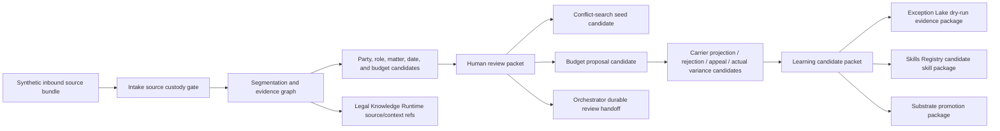

> **PORTED 2026-07-09 from the stale intake snapshot ("copy A") — CORRECTIONS APPLY:**
> 1. The canonical intake repo is THIS repo (seed-clean B). Copy A is archived; never edit it.
> 2. This document was authored against copy A (~74 schemas) and UNDERSTATES this repo
>    (~420 schemas): the learning loop it proposes ALREADY EXISTS here
>    (budget-learning-loop-*, carrier-rejection-learning-*, reviewed-learning-gate-*,
>    learning-promotion-readiness-*, learning-shadow-eval-*, learning-owner-handoff-*).
>    Read it for the DAD pattern and hard kernels, not as a gap analysis.
> Orchestration home: 04_Digital_Assett_Directory/orchestration/ (ARCHITECTURE_PACKET.md).

# LawFirm OS DAD-Layer Architecture Plan

Status: local candidate architecture handoff
Date: 2026-07-09
Audience: Opus 4.8, Fable, Composer 2.5 in Cursor, GLM 5.2

## Purpose

This plan adapts the useful structural pattern from the Digital Asset Directory
(DAD) into LawFirm OS without copying the private DAD catalog, private asset
inventory, or any real client/matter/privileged material.

The intended result is a small, valuable, public-safe digital asset and learning
spine that proves how LawFirm OS works:

- governed workflow assets;
- source-faithful data flows;
- candidate-only learning loops;
- human review before promotion;
- deterministic validation;
- cross-repo handoffs that respect authority boundaries.

The build agent after architecture review is expected to be Composer 2.5 in
Cursor or GLM 5.2. Fable should therefore produce implementation instructions
as small, file-scoped PRs with exact invariants, fixtures, validators, and stop
conditions.

## Source Corpus Inspected

Root coordination shell:

- `AI_FRONT_DOOR.md`
- `AI_WORK_START_HERE.md`
- `docs/CROSS_REPO_AUTHORITY_MAP.md`
- `docs/GITHUB_SYNC_AUDIT.md`
- `docs/HUMAN_DECISION_RECORD_2026-07-08.md`

Semantic Substrate:

- `AI_WORK_START_HERE.md`
- `registry/ai-front-door-registry.json`
- `registry/lawfirm-os-repo-registry.json`
- `governance/CROSS_REPO_MAP.md`

Intake repo:

- `AGENTS.md`
- `AI_WORK_START_HERE.md`
- `AI_TABLE_OF_CONTENTS.md`
- `GOVERNANCE_BOUNDARY.md`
- `REPO_ROLE.md`
- `README.md`
- `repo_topology.yaml`
- `skill-agent-manifest.json`
- `contracts.lock.json`
- `docs/architecture.md`
- `docs/workflow/intake-to-budget.md`
- `docs/workflow/state-machine.md`
- `DATA_FLOW_MAP.md`
- `docs/lawfirm-os-integration.md`
- `docs/ai-handoff/BUILDER_BRIEF.md`
- `docs/ai-handoff/FIRST_10_PRS.md`
- `docs/ai-handoff/OPEN_QUESTIONS.md`
- selected `src/lawfirm_os_intake/`, `tests/`, `schemas/`, `config/`,
  `contracts/`, `fixtures/`, and `apps/legal-intake-budget/` inventories

DAD pattern source:

- `README.md`
- `AI_FRONT_DOOR.md`
- `AGENTS.md`
- `MACHINE_NAV.md`
- `docs/ARCHITECTURE.md`
- `docs/ASSET_IDENTITY_AND_SIMILARITY_LADDER.md`
- `docs/ASSET_VALUE_MODEL.md`
- `docs/MAIL_CENTER.md`
- `docs/AI_ENTRYPOINT_AND_TOC_ROUTING_STANDARD.md`
- `docs/DETERMINISTIC_LEARNING_RULES.md`
- `docs/ASSET_USE_PAY_FORWARD_LOOP.md`
- `docs/DATA_DICTIONARY.md`
- `docs/CROSS_REPO_WORKFLOW_ASSET_PATTERNS.md`

## Current Repo-Family Model

| Repo | Owns | Must Not Own |
|---|---|---|
| `LawFirm-os-semantic-substrate` | Canonical schemas, registries, governance doctrine, route IDs, event classes, lifecycle policy, promotion policy, AI front door | Vertical workflow implementation, runtime execution, local convenience overrides |
| `LawFirm-os-orchestrator` | Execution-plane orchestration, evidence packet workflows, durable pause/resume, human workflow coordination | Canonical meaning, uncontrolled learning, client-data mutation without authority |
| `LawFirm-os-exceptions-lake-runtime-main` | Append-only evidence and audit runtime records | Canonical doctrine, silent correction, deletion of evidence, direct promotion to canon |
| `LawFirm-os-legal-knowledge-runtime` | Legal knowledge runtime helpers, source refs, passage refs, claim refs, context bundle assembly under substrate contracts | Intake workflow authority, legal conclusions without source/human gates |
| `LawFirm-os-skills-registry` | Draft/candidate skills, supply-chain evaluation, packaging, trust scans | Canonical promotion authority, runtime matter authority |
| `LawFirm-os-intake` | Vertical workflow composition, synthetic fixtures, evals, review packets, candidate handoffs, reference workflow | Canonical schemas, route IDs, event classes, real data, direct sibling mutation |
| `billing-guideline-simulator` | Future simulator-style budget/guideline experimentation, if kept in scope | Canonical OCG/rate authority unless promoted by substrate |
| DAD private repo | Private asset discovery, identity, value, pay-forward, mail, and governance learning patterns | Direct LawFirm OS runtime authority |

## Architecture Diagnosis

LawFirm OS already has a strong governed intake-to-budget skeleton. The biggest
gap is not more parsing. The gap is a reusable asset-and-learning layer that
explains how valuable workflow knowledge moves through the repo family without
becoming authority by accident.

The current system has:

- a synthetic-only intake workflow;
- a candidate conflict seed boundary;
- budget proposal and carrier projection surfaces;
- rejection, appeal, variance, QA, review UI, and DAD mailbox safety scaffolds;
- repo authority boundaries and promotion concepts.

The system still needs:

- a minimal LawFirm OS digital asset registry that is safe to share;
- explicit asset-use and pay-forward records;
- a learning candidate packet that captures corrections without silent
  promotion;
- deterministic checks that block real data and authority laundering;
- cross-repo data-flow maps that show where each candidate artifact can move;
- Fable-reviewed hard kernels for cross-matter learning, privacy, authority,
  and append-only evidence problems.

## DAD Pattern To Copy Structurally

Copy the pattern:

- stable digital asset identity;
- asset value/use metadata;
- workflow-part candidates;
- candidate learning records;
- local mailbox mirror;
- append-only evidence;
- promotion gates;
- governance dependency maps;
- AI front-door discoverability;
- validators that fail closed.

Do not copy:

- private DAD asset inventory;
- private paths;
- private asset scores;
- internal strategy notes;
- raw client/matter/privileged data;
- any DAD authority that would override LawFirm OS substrate governance.

## Minimal LawFirm OS Digital Asset Set

These assets are valuable enough to demonstrate the OS, but narrow enough not to
give away the full private DAD catalog.

| Candidate Asset ID | Purpose | Initial Owner | Promotion Target |
|---|---|---|---|
| `asset.intake.source-custody-segmentation-gate` | Preserve source IDs, offsets, hashes, attachment states, and segment provenance | Intake | Substrate contract candidate, Orchestrator execution contract |
| `asset.intake.conflict-seed-boundary-check` | Prove intake emits conflict-search seeds only, never conflict clearance | Intake | Substrate boundary doc, Orchestrator human gate |
| `asset.intake.budget-driver-preflight-matrix` | Show budget proposal factors, missing inputs, source coverage, and review blockers | Intake | Legal Knowledge Runtime context refs, Orchestrator review packet |
| `asset.intake.carrier-rejection-learning-loop` | Convert rejection/appeal/actual variance into candidate lessons without auto-updating rules | Intake | Exception Lake candidate, Skills Registry candidate skill, Substrate promotion package |
| `asset.intake.human-review-packet-template` | Make reviewer decisions first-class and auditable | Intake | Orchestrator durable review workflow |
| `asset.intake.qa-product-confidence-gate` | Tie QA readiness, product confidence, and blocked actions to evidence | Intake | Orchestrator run readiness, Substrate lifecycle policy candidate |
| `asset.intake.dad-mailbox-safety-audit` | Demonstrate local DAD-style message safety without contacting DAD hub | Intake | DAD mirror contract candidate, Skills Registry safety pattern |

## Target Workflow Data Flow

No arrow above authorizes real-data use, external writes, matter opening,
conflict clearance, legal advice, budget submission, profile mutation, or
canonical governance changes.

## Learning Loop Contract

Every learning loop should preserve this separation:

| Layer | Meaning | Example |
|---|---|---|
| Source fact | Extracted or referenced from a governed source with provenance | Email says a payer rejected a budget line |
| Model proposal | Candidate interpretation only | Agent suggests rejection reason family |
| Human confirmation | Reviewed decision or correction | Reviewer confirms reason family and follow-up owner |
| Candidate learning | Proposed future change with scope and evidence | "Add missing follow-up owner gate to rejection loop" |
| Promotion target | Repo that may own the promoted rule after review | Substrate, Orchestrator, Lake, Skills Registry, Legal Knowledge Runtime |

Learning must never silently mutate canon, budgets, rates, guidelines, profiles,
workflow gates, skills, or legal context.

## Build Roadmap

### Phase 0: Hygiene And Authority Lock

Goal: stop accidental cross-repo confusion before feature work.

Actions:

- reconcile the duplicate/local checkout situation;
- confirm live GitHub `main` for each active repo before PR work;
- do not push from the root coordination shell;
- record any dirty work or untracked work before edits.

Exit:

- clean per-repo branch plan;
- no claim that the root is GitHub-synced;
- owner-approved list of repos to edit.

### Phase 1: Architecture And Handoff Packet

Goal: give Fable and the implementation agent a precise target.

Actions:

- add this architecture plan;
- add Opus 4.8 intake prompt;
- add Fable master architect prompt;
- add hard-kernel list;
- add AI TOC discoverability.

Exit:

- docs are validation-clean;
- no runtime behavior changes.

### Phase 2: Intake Minimal Asset Registry

Goal: create the smallest safe DAD-style asset spine.

Candidate files:

- `registry/lawfirm-os-digital-assets.candidate.json`
- `schemas/lawfirm-digital-asset-card.schema.json`
- `fixtures/digital-assets/*.json`
- `docs/digital-assets/minimal-asset-spine.md`
- focused tests/validator updates

Rules:

- synthetic and public-safe only;
- no private DAD IDs or paths;
- every asset has data class, authority level, owner, value basis, promotion
  target, and blocked uses.

### Phase 3: Asset Use And Pay-Forward Records

Goal: show how workflow knowledge improves without becoming authority.

Candidate files:

- `schemas/asset-use-record.schema.json`
- `schemas/learning-candidate-packet.schema.json`
- `src/lawfirm_os_intake/asset_learning.py`
- `tests/test_asset_learning.py`
- synthetic fixtures under ignored or tracked synthetic-only paths

Rules:

- candidate-only;
- no real matter data;
- no auto-promotion;
- reviewed source or human review required for promotion.

### Phase 4: Carrier Rejection And Variance Learning Loop

Goal: make a real legal-ops loop visible.

Flow:

1. budget proposal;
2. carrier-compliant projection;
3. rejection or appeal;
4. actual variance;
5. human review;
6. candidate learning;
7. dry-run Exception Lake package;
8. promotion package if approved.

Blocked:

- real carrier guidelines;
- negotiated rates;
- profile mutation;
- budget submission;
- appeal submission.

### Phase 5: Orchestrator Review Handoff

Goal: make intake output runnable by the execution plane without giving intake
execution authority.

Needed artifacts:

- durable pause/resume candidate packet;
- owner/deadline/no-deadline rationale gates;
- evidence packet manifest;
- human action queue contract candidate.

### Phase 6: Exception Lake Dry-Run Admission

Goal: prepare append-only evidence candidates without writing to the Lake.

Needed artifacts:

- stable identity and dedupe keys;
- source refs and hashes;
- severity;
- lineage;
- privacy/compliance flags;
- no-write proof fields.

### Phase 7: Legal Knowledge Runtime Context Refs

Goal: let intake ask for structured legal context without owning research
canon.

Needed artifacts:

- source/passsage/claim ref mapping;
- public-source-to-synthetic conversion spec;
- no legal advice guarantee;
- no direct public payload in tracked fixtures.

### Phase 8: Skills Registry Candidate Packaging

Goal: package only reviewed specialist behavior as candidate skills.

Needed artifacts:

- candidate skill card;
- prompt hash;
- eval fixture;
- supply-chain scan result;
- authority boundary.

### Phase 9: Substrate Promotion Package

Goal: promote only the pieces that truly belong in canon.

Needed artifacts:

- governance dependency-map update;
- registry rows;
- schema candidates;
- validators;
- migration notes;
- open human decisions.

## Real Workflows To Add Or Strengthen

Highest value first:

- intake source custody and provenance-preserving segmentation;
- human review packet for party, role, matter posture, conflict seed, and budget;
- budget proposal to carrier projection to rejection/appeal/actual variance;
- Exception Lake dry-run handoff;
- DAD-style local asset-use/pay-forward loop;
- legal knowledge context bundle request and source-ref handling;
- read-only review UI for blocked actions and confidence gates;
- future synthetic-only trial/simulation handoff, separate from client work,
  after the intake and evidence gates are stable.

## Fable Architecture Questions

Ask Fable to resolve:

- What is the exact minimum digital asset schema that creates value but does
  not reveal the private DAD catalog?
- Which asset metadata belongs in intake versus substrate?
- Which learning packet fields are universal enough to propose upstream?
- Which validation gates should fail closed in intake before any sibling repo
  sees a candidate artifact?
- How should the Exception Lake represent retroactive screens over append-only
  evidence?
- How should cross-matter non-interference be proven for learning loops?
- What is the smallest first PR a Composer 2.5 or GLM 5.2 implementation agent
  can safely build?

## Hard Boundaries

- No real client data.
- No real matter data.
- No privileged material.
- No real carrier guideline or negotiated rate data.
- No external connector.
- No DAD hub contact.
- No direct sibling mutation.
- No canonical schemas, route IDs, event classes, or taxonomies from intake.
- No AI-generated material as legal, compliance, or governance authority.
- No matter opening, conflict clearance, deadline docketing, budget submission,
  appeal submission, or profile mutation.

## First Safe Implementation PR After Fable

Recommended first PR after Fable review:

- create a candidate digital asset card schema;
- create a candidate registry with the seven minimal assets above;
- add one golden synthetic fixture;
- add a validator that enforces data class, authority level, owner,
  promotion target, blocked uses, and no private DAD path leakage;
- update AI TOC and docs;
- run repo validation.

This first PR should not change runtime workflow behavior.
