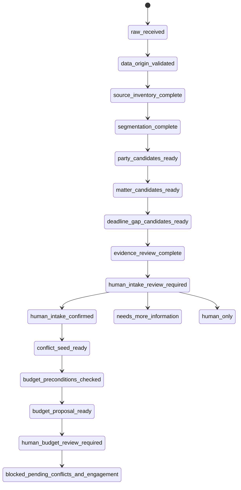

# State Machine

## Protected transitions

Only an authorized human may create:

- `human_intake_confirmed`
- `declined_or_referred`
- future `human_budget_approved`
- future `conflicts_cleared`
- future `engagement_authorized`
- future `matter_opening_approved`

See `workflow/prohibited-transitions.yaml`.
